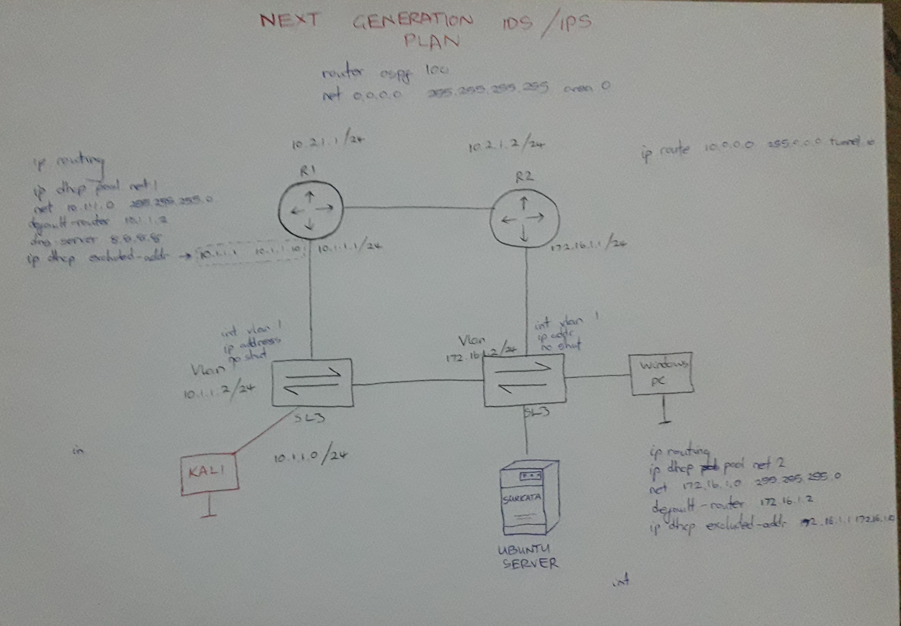
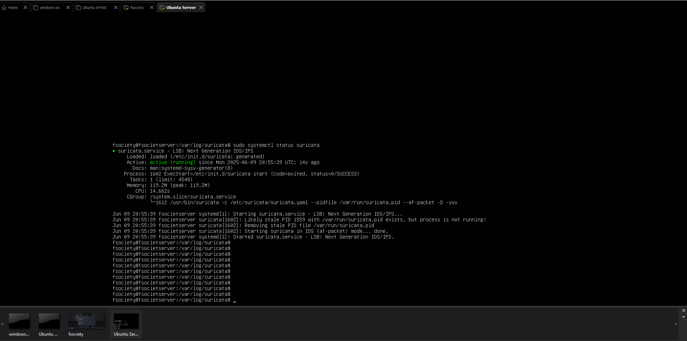
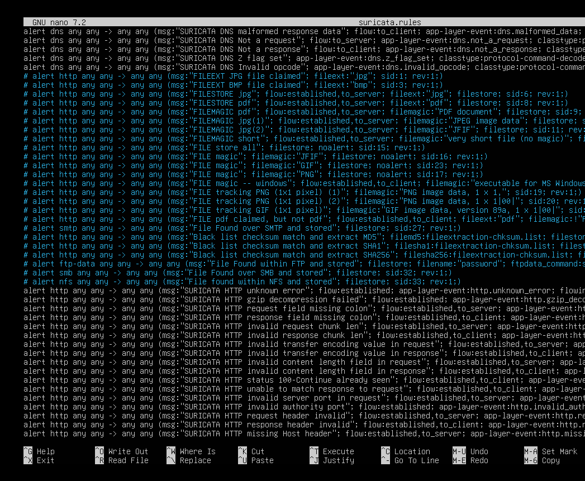
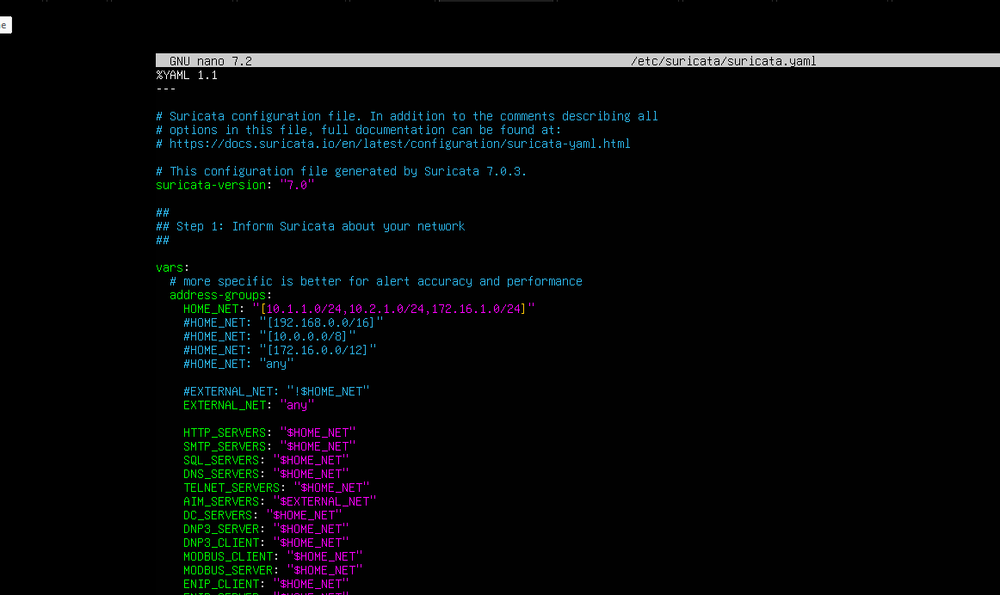
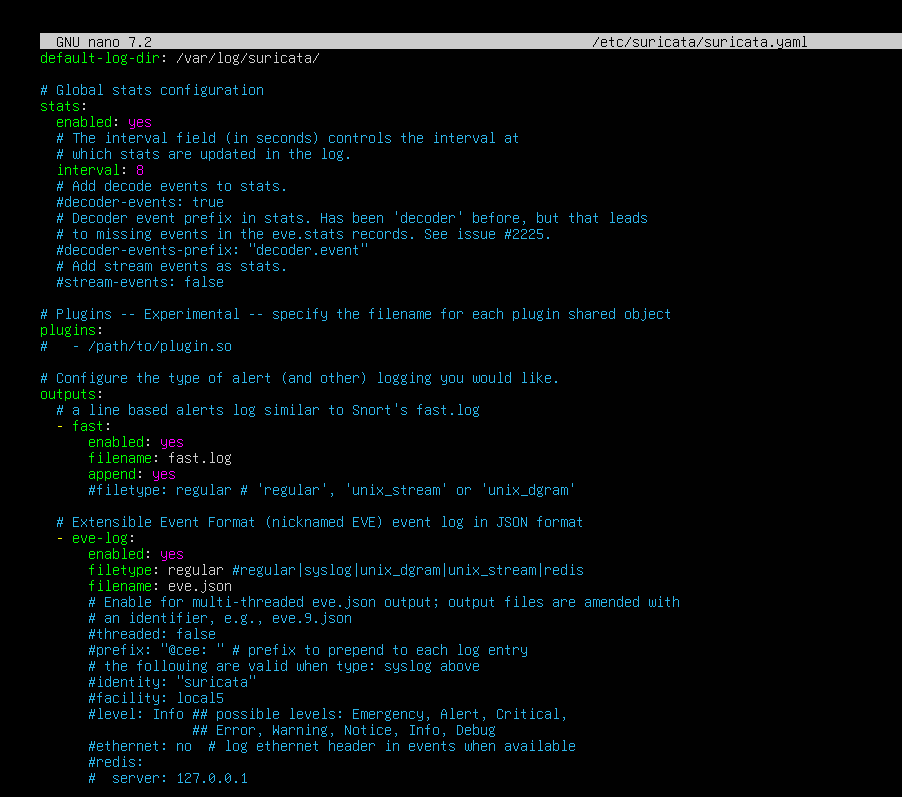
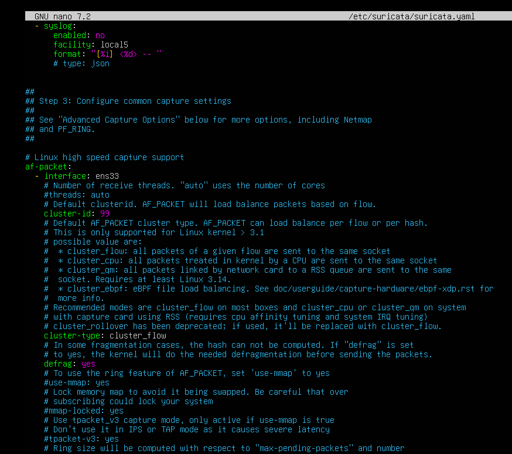
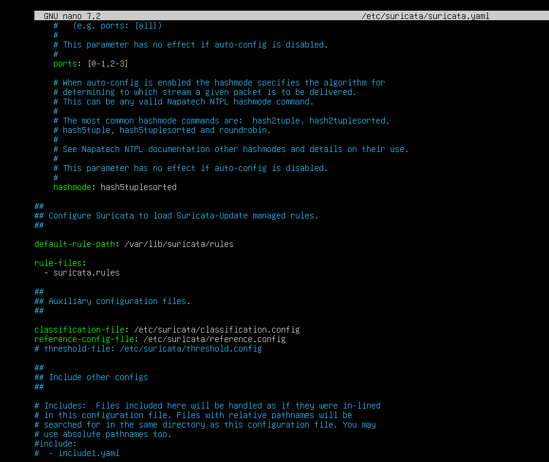
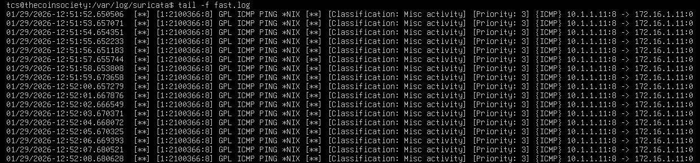
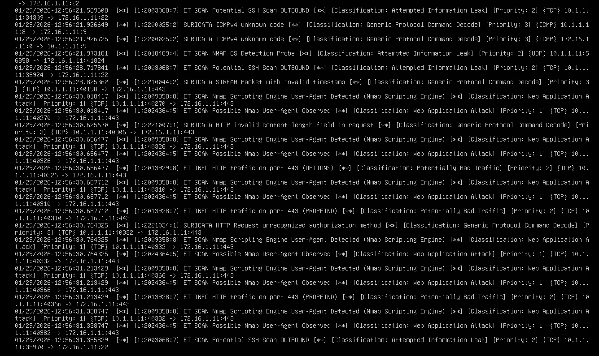

# NEXT GENERATION IDS/IPS SYSTEM

### 📌 Objective

To implement and test Suricata: a high performance, open source network threat detection engine.

The following network topology, configurations and PCs were to be connected virtually.

### Activities Done

- I installed GNS3VM, Kali Linux, Ubuntu Server and Windows Machine in VMWare Workstation Pro
- I installed Suricata in Ubuntu Server where it will be tested and successfully enable it to run automatically when the Virtual Machine is turned on

- Arranged the network environment as done in the drawing, in GNS3 - getting help from Mr Chinyuku on how to install relevant IOU Switches for the network.
- I configured the whole network but faced challenges on pinging Switch 1 to the network 10.2.1.1 and Switch 2 to network 10.2.1.2. This was because I was forgetting to command the switch through a default router gateway.
- ip routing
ip route 0.0.0.0 0.0.0.0 <network>
- With time Switch 1 pinged Switch 2, thus the routers R1 R2 were able to advertise IP among all 3 networks 10.1.1.0, 10.2.1.0-10.2.1.2 and 172.16.1.0

- I connected devices, Kali Linux VM to Switch 1 and Ubuntu Server to Switch 2. But whenever I tried connecting the Windows Machine to Switch 2, it would crush it and turn off. Nothing yet has been done to solve the problem
    
    .png)
    

- Meanwhile I set the Kali VM to get an IP from R1 Automatically (DHCP) but it wouldn’t so to be quick I had to statically assign it and it successfully pinged Switch 2.

.png)

- The Ubuntu Server successfully got an IP automatically through the following commands: sudo dhclient -v ens33 but noted that dhclient is not installed automatically in linux so had to install it through sudo apt install isc-dhcp-client
- The Ubuntu Server was able to ping PC kali-1

.png)

### Installing Suricata

According to the official suricata documentation https://docs.suricata.io/en/suricata-8.0.2/

Suricata will be installed in ubuntu server using command sudo apt install suricata. After installation there is need of updating rules so that suricata can be able to detect and alert necessary anomalies. These rules are updated using the command suricata-update. The rules’ default files and directory as of 2023 was */etc/suricata/rules* until an update was made so that rules become consistent with suricata when installed with suricata-update command. Let me confirm whether the rules are updated in the suricata.rules file.

**The Configuration File and Rule Writing**

To make sure suricata logs according to the network my network I have to update the suricata configuration file. This file’s default location is the */etc/suricata/suricata.yaml* and will be opened and edited using sudo nano /etc/suricata/suricata.yaml 

In line with my network address configuration I am going to tell suricata which networks it should look at.

The network specification was done at the vars: address-groups: HOME_NET:

Outputs for logs are already update where they should be, in the */var/log/suricata .*

An update on  which interface Suricata will use to detect anomalies should be made so that it knows where to take relevant information from.

The last thing on suricata configuration file for now is make sure that Suricata is taking rules from the correct file/directory which is */var/lib/suricata/rules* 

**Testing Function**

Now I have to test if Suricata is working, logging correct detections, classifying and prioritising them accordingly. I will use the ping command and Nmap from the Kali Linux machine in the Network.

Logs are viewed in the */var/log/suricata/fast.log .*

Ping

As you can see it is logging all the ping packets detected.

Nmap

Let me do an Aggressive Nmap scan which also request OS details of the Server.

As you can see it is logging detections and categorising them and also siting which tool was used to do the activities logged. 

The next thing is to look in to different network threats to see if suricata can detect them.

So am going to install Yersinia and Ettercap in Kali Linux with their GUIs also and gather more information about these tools. All I know right now is that they are layer 2 attacking tools.

I successfully installed Ettercap and it’s GUI

.png)

Yersinia was installed but the GUI couldn’t be.

.png)

So Yersinia was named after a plague-causing bacteria Yersinia Pestis🤔

