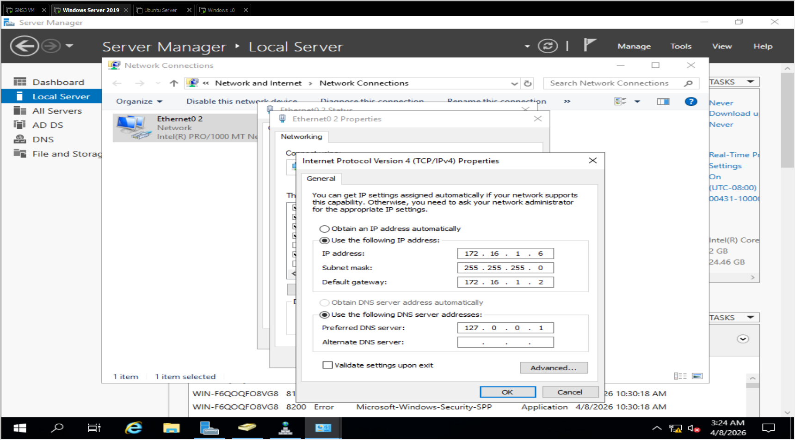
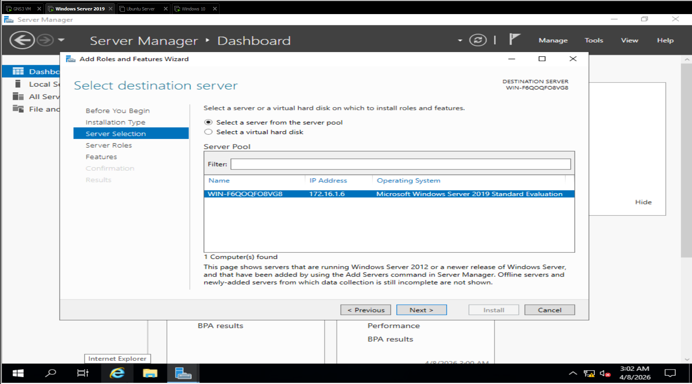

# Active Directory Implementation

## Overview

This document covers the implementation of **Microsoft Active Directory
Domain Services (AD DS)** within the **TheCoinSociety** GNS3/VMware lab
environment.

A Windows Server 2019 system was configured as the Domain Controller and
DNS server for the `thecoinsociety.local` domain. A Windows 10
workstation was then joined to the domain to validate centralised
authentication and domain management.

------------------------------------------------------------------------

## 1. Server Preparation

Before installing Active Directory, the Windows Server was prepared with
a static network configuration.

  Setting            Value
  ------------------ --------------------------------
  Operating System   Windows Server 2019
  Server IP          `172.16.1.6`
  Subnet Mask        `255.255.255.0`
  Default Gateway    `172.16.1.1`
  Domain             `thecoinsociety.local`
  Role               Domain Controller / DNS Server

A static IP address was used to ensure that domain clients could
consistently locate the Domain Controller and DNS service.

### Evidence





------------------------------------------------------------------------

## 2. Active Directory Domain Services Installation

The **Active Directory Domain Services (AD DS)** role was installed
through Windows Server Manager using **Add Roles and Features**.

The AD DS role and its required management tools were selected and
installed on the Windows Server.

### Evidence

> **Screenshot:** Server Manager showing the Active Directory Domain
> Services role installation.

------------------------------------------------------------------------

## 3. Domain Controller Promotion

After AD DS installation, the server was promoted to a **Domain
Controller**.

A new Active Directory forest was created for:

``` text
thecoinsociety.local
```

DNS Server and Global Catalog functionality were included during the
Domain Controller configuration.

The prerequisite checks completed successfully and the server restarted
to complete the promotion.

### Evidence

> **Screenshot:** AD DS Configuration Wizard showing the new
> forest/domain configuration.

> **Screenshot:** Prerequisite check confirming that the server was
> ready for promotion.

> **Screenshot:** Windows Server login after successful Domain
> Controller promotion.

------------------------------------------------------------------------

## 4. DNS Configuration

DNS was integrated with Active Directory so that domain systems could
locate the Domain Controller and other domain services.

The Domain Controller used:

``` text
172.16.1.6
```

as its internal DNS server.

During testing, domain systems could communicate by IP address but
external hostname resolution failed. The issue was traced to DNS
forwarding.

A DNS forwarder was configured on the Domain Controller so unresolved
external queries could be forwarded outside the Active Directory DNS
zone.

``` powershell
Add-DnsServerForwarder -IPAddress "8.8.8.8" -PassThru
```

After the change, DNS resolution and internet access were restored while
domain clients continued using the Domain Controller for DNS.

### Evidence

> **Screenshot:** DNS/PowerShell testing confirming name resolution
> through the Domain Controller.

------------------------------------------------------------------------

## 5. Active Directory Users and Groups

Active Directory user accounts and security groups were created to
demonstrate centralised identity and access management.

The implementation provided a foundation for managing:

-   Domain users
-   Administrative accounts
-   Security groups
-   Computers
-   Organisational Units (OUs)

This allowed identities and domain resources to be managed centrally
rather than individually on each workstation.

### Evidence

> **Screenshot:** Active Directory Users and Computers showing user
> account creation.

> **Screenshot:** Active Directory Users and Computers showing
> configured users/groups.

------------------------------------------------------------------------

## 6. Windows 10 Domain Join

A Windows 10 workstation was configured to use the Domain Controller at
`172.16.1.6` for DNS.

Connectivity to the Domain Controller was verified before the
workstation was joined to:

``` text
thecoinsociety.local
```

Domain administrator credentials were supplied during the join process.
Windows confirmed successful membership of the domain and the
workstation was restarted.

### Evidence

> **Screenshot:** Windows 10 domain configuration.

> **Screenshot:** Successful domain join confirmation.

> **Screenshot:** Windows 10 System Properties showing membership of
> `thecoinsociety.local`.

------------------------------------------------------------------------

## 7. Domain Authentication

After the workstation joined the domain, login using a domain account
was tested.

The Windows 10 login screen recognised **TheCoinSociety** as the domain,
confirming that the workstation could communicate with the Domain
Controller and authenticate domain users.

### Evidence

> **Screenshot:** Windows 10 domain-user login screen.

------------------------------------------------------------------------

## 8. Group Policy

Basic Group Policy configuration was introduced to provide centralised
control over domain users and workstations.

The lab documentation includes policies covering areas such as:

-   Password requirements
-   Account lockout
-   Workstation restrictions
-   Screen locking
-   Security auditing

This established a foundation for further Active Directory hardening and
security-policy testing.

------------------------------------------------------------------------

## 9. Validation

The implementation was validated by confirming that:

-   Active Directory Domain Services was installed successfully.
-   The Windows Server was promoted to a Domain Controller.
-   The Active Directory domain was operational.
-   DNS was integrated with Active Directory.
-   Domain users and groups could be managed centrally.
-   The Windows 10 workstation successfully joined the domain.
-   Domain authentication worked from the Windows 10 workstation.
-   External DNS resolution worked after the DNS forwarding issue was
    corrected.

------------------------------------------------------------------------

## 10. Result

The Active Directory implementation successfully established a
**centralised Windows identity and authentication environment** for
TheCoinSociety lab.

The Domain Controller now provides the foundation for user and computer
management, DNS, domain authentication and Group Policy administration.

The environment can also be used for separate security-testing exercises
involving Active Directory enumeration, attack simulation and detection.
Those activities are documented separately from the core implementation.
