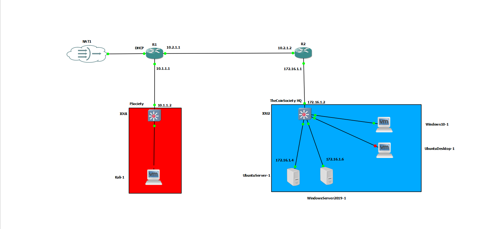

# Active Directory

## Project Overview

This project documents the implementation of **Microsoft Active Directory Domain Services (AD DS)** within **TheCoinSociety** enterprise-style network lab.

A **Windows Server 2019** machine was configured as a Domain Controller to provide centralised identity management, authentication, DNS and domain services for Windows systems within the environment. A Windows 10 workstation was subsequently joined to the domain and authenticated using domain credentials.

The Active Directory environment forms part of the wider **TheCoinSociety GNS3 lab**, alongside the Wazuh, Suricata and Zabbix implementations.

---

## Objectives

- Deploy Active Directory Domain Services on Windows Server 2019.
- Promote the server to a Domain Controller.
- Establish the `thecoinsociety.local` domain.
- Configure Active Directory-integrated DNS.
- Create and manage domain users and security groups.
- Join a Windows 10 workstation to the domain.
- Provide centralised authentication and management.
- Establish an Active Directory environment for further security monitoring and testing.

The original implementation also included objectives around organisational units, Group Policy and Wazuh integration.

---

## Lab Environment

| Component | Configuration |
|---|---|
| Virtualisation | VMware |
| Network Simulation | GNS3 VM |
| Domain Controller | Windows Server 2019 |
| Domain | `thecoinsociety.local` |
| Domain Controller IP | `172.16.1.6` |
| Internal Gateway | `172.16.1.1` |
| Client | Windows 10 |
| Directory Service | Active Directory Domain Services |
| DNS | Windows Server DNS |

The Domain Controller was deployed at `172.16.1.6` within the same internal network as the other TheCoinSociety systems.

---

## Implementation Summary

The Windows Server was prepared with a static network configuration before the **Active Directory Domain Services** role was installed. The server was then promoted to a Domain Controller and configured to provide DNS services for the domain.

Following the deployment, Active Directory users and security groups were created and a Windows 10 workstation was successfully joined to `thecoinsociety.local`.

The implementation therefore established a working centralised Windows authentication environment within the lab.

Detailed configuration and supporting screenshots are available in the **Implementation** documentation.

---

## Network Integration

Active Directory operates as part of the wider TheCoinSociety infrastructure rather than as an isolated system.




The Windows Server provides **AD DS and DNS**, while Windows 10 operates as a domain member. The Ubuntu Server hosts the other monitoring and security platforms used within the wider lab.

---

## Key Technologies

`Windows Server 2019` · `Active Directory Domain Services` · `DNS` · `Group Policy` · `Windows 10` · `GNS3` · `VMware`

---

## Project Outcome

The implementation resulted in a functional Active Directory environment capable of providing:

- Centralised user authentication
- Domain-based Windows administration
- Active Directory-integrated DNS
- Domain user and computer management
- Windows workstation domain membership
- A foundation for Group Policy administration
- A controlled environment for future Active Directory security testing

Testing documented in the original project confirmed successful AD DS installation, Domain Controller promotion, domain creation, DNS integration, user creation and Windows 10 domain membership.

---

## Repository Structure

```text
Active-Directory/
│
├── README.md
│
├── Implementation/
│   └── README.md
│
└── Security-Testing/
    └── README.md
```

The **Implementation** section documents the actual deployment and configuration process with supporting evidence.

The **Security-Testing** section is kept separate from the core implementation and can later document practical Active Directory security assessments such as enumeration, BloodHound analysis and controlled attack simulations.
